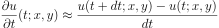
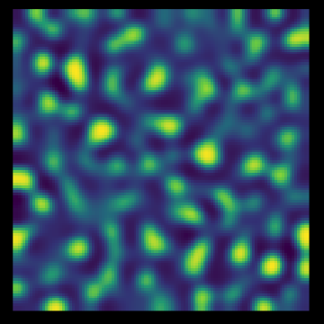

# morphogenesis

- **morph.R**: *R* script for generating video frames for morphogenesis simulations
- **ffmpeg.txt**: *ffmpeg* commands for tiling and compiling videos
- based on [this](https://ipython-books.github.io/124-simulating-a-partial-differential-equation-reaction-diffusion-systems-and-turing-patterns/) Python code/model

## Introduction
In 1952, [Alan Turing](https://en.wikipedia.org/wiki/Alan_Turing) proposed a [theory](https://en.wikipedia.org/wiki/The_Chemical_Basis_of_Morphogenesis) on how the structured patterns found in nature – think zebra stripes, leopard spots – could arise from a uniform homogeneous distribution of two chemicals: an *activator* that encourages pigmentation, and an *inhibitor* that reacts with and opposes the activator. Their chemical interactions can be described physically as a [reaction-diffusion](https://en.wikipedia.org/wiki/Reaction–diffusion_system) system, which spontaneously gives rise to the structured patterns found in biology.

We can simulate this by solving the [Fitzhugh-Nagumo](https://en.wikipedia.org/wiki/FitzHugh–Nagumo_model) (a mercifully tractable form of reaction-diffusion system, initially developed to describe neuron excitation/relaxation) equations...

<!--FN1: \frac{\partial u}{\partial t} = a \nabla^2 u + u - u^3 - v + k
-->

<!--FN2: \tau \frac{\partial v}{\partial t} = b \nabla^2 v + u - v
-->

... here *u* and *v* represent the concentration of the activator and inhibitor respectively, *a, b, c, d, τ, k* are arbitrary parameters, and ∇2 represents the [Laplacian](https://en.wikipedia.org/wiki/Laplace_operator) operator (i.e. the divergence of the gradient field at the point (*x*, *y*)).

## Simulation
In order to model this system in such a way that we can see appreciable patterns forming, we can create a finite discrete (*x*, *y*) grid, and solve the equations over this space numerically. For differentiation with respect to time at every point in the grid, we can use the one dimensional finite difference with a suitably small value of *dt*.

<!-- time-diff: \frac{\partial u}{dt}(t; x,y) \approx \frac{u(t+dt; x,y) - u(t;x,y)}{dt} -->

Solving the spatial part of the problem requires approximating the Laplacian operator to the 2D discrete case, which we can do using the [five point stencil method](https://en.wikipedia.org/wiki/Five-point_stencil#Two_dimensions) where *h* is e.g. the length unit of the grid (~ a pixel).

<!--quincunx Laplace: \nabla^2(x,y) \approx \frac{u(x+h,y) + u(x-h,y) + u(x,y+h) + u(x,y-h) - 4u(x,y)}{dx^2}
-->

Combining these, we come up with the following update step for the activator distribution *u* (and an analogous one for the inhibitor distribution *v*).
<!-- Uupdate: u(t+dt; x,y) = u(t; x,y) + \left( a\nabla^2 u(t; x,y) +u(t;x,y) - u(t;x,y)^3 - v(t;x,y) \right )dt -->

Simulating the time evolution of the system is then a matter of looping through time *t*, and updating the equations over the grid...

### Steps
1. populate grid with uniform random noise
2. loop over time steps
    - perform update for activator distribution *u*
    - perform update for inhibitor distribution *v*
    - if desired, output frame of the activator distribution to show "pigmentation"
3. stitch together frames into video

## Results

If we set *a* = 4e-4, *b* = 5e-3, *τ* = 0.1, and *k* = -5e-3 and run the simulation starting with completely random noise at *t = 0*, we get the following evolution over time.

<strong>t = 0</strong>

 

<strong>t = 2,000</strong>

 

<strong>t = 8,000</strong>

 

<strong>t = 20,000</strong>

We can see the initial random noise evolving into a somewhat pleasant, blobby and stripey pattern.

Using *ffmpeg* we can also stitch together multiple frames of the simulation to give an animated video; and then tile multiple videos together to show how altering some of the parameters affects the simulation. See **[YouTube video](https://www.youtube.com/watch?v=xxZlMIchows)**.
